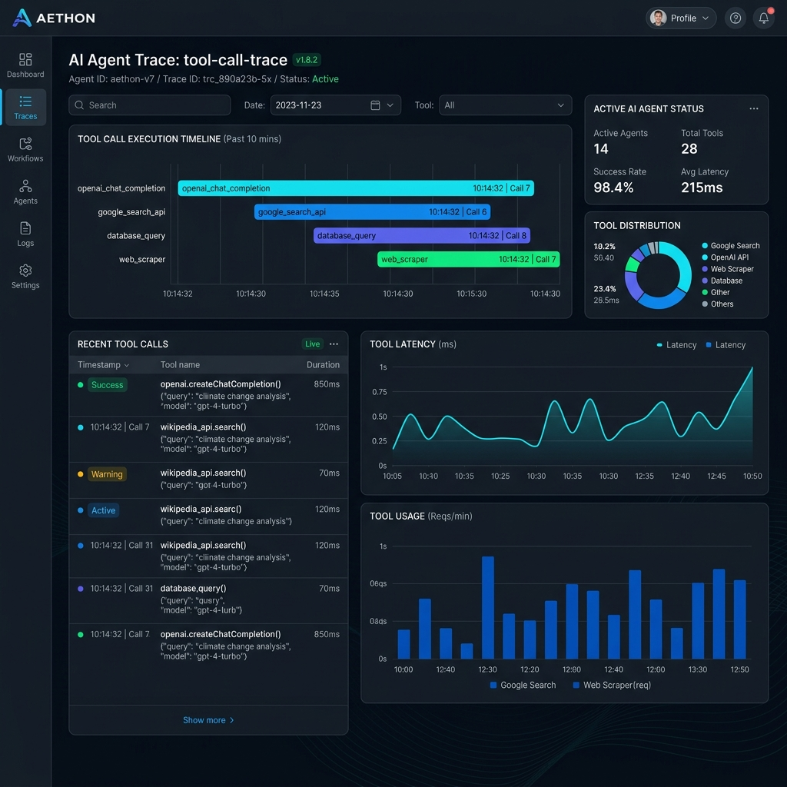

<div align="center">


# AgentSpec
**The industry standard for deterministic, resilient, and blazing-fast Agentic testing.**



[](https://pypi.org/project/agentcontract/)
[](https://pypi.org/project/agentcontract/)
[](https://opensource.org/licenses/MIT)
[]()
[](https://github.com/psf/black)

*Stop scoring agent output quality with "vibes". Start enforcing agent behavior with code.*

[Documentation](#quick-start) • [Features](#key-features) • [Installation](#installation) • [Contributing](CONTRIBUTING.md)

</div>

---

> [!CAUTION]
> You shipped an agent to production without tests. Now it's 3 AM and your PagerDuty is screaming. The booking agent called `cancel_reservation` before `verify_payment`. The LLM "vibe check" passed in CI, but real users hit catastrophic edge cases your evals never caught. *AgentSpec fixes this.*

## 🌟 What is AgentSpec?

**AgentSpec** (via the `agentcontract` package) is the first deterministic testing framework for AI agents. Unlike traditional agent evaluation tools that score LLM output quality using probabilistic metrics, AgentSpec provides **deterministic contracts** that assert exactly what your agent MUST do, MUST NOT do, and MUST do in what order.

Think of it as:
- **Pact** for agent/API contracts — but for tool calls.
- **Jest snapshots** — but for agent trajectories.
- **Chaos engineering** — but for agent resilience testing.

---

## ⚡️ Key Features (v0.2.0)

| Feature | Description |
|:---|:---|
| 🛡 **Deterministic Assertions** | Test tool executions, parameter accuracy, strict ordering, and thresholds with 100% determinism. |
| ⏱ **Async & Sync Support** | Natively utilize `.arun()` with full compatibility for `pytest-asyncio` workflows. |
| 👯‍♀️ **Multi-Agent Tracking** | Isolate concurrent interactions using specific `agent_id` tracking parameters stringently preventing cross-contamination. |
| 🌩 **Advanced Chaos Injection** | Ensure resilience by simulating targeted failures, latency spikes, response formatting corruption, or random chaos. |
| ⚡️ **Performance Constraints** | Define explicit bounds for full operational trajectory times (`assert_total_duration_under(ms)`) and singular tool executions (`within_ms(ms)`). |
| 📸 **Trajectory Snapshots** | Capture "golden" paths as JSON profiles to rigidly lock regression behaviors. |
| 💎 **Trace Visualizer UI** | Launch a beautiful premium local web dashboard to visually trace inputs, outputs, and JSON trajectories via `agentcontract ui`. |
| 🔌 **Framework Agnostic** | Contains baked-in adapters for OpenAI, Anthropic, Langchain, and Custom frameworks. |

---

## 🚀 Quick Start

### Installation

```bash
pip install agentcontract
```

*For specific framework support:*
```bash
pip install agentcontract[openai]      # OpenAI support
pip install agentcontract[anthropic]   # Anthropic support  
pip install agentcontract[langchain]   # LangChain support
pip install agentcontract[all]         # All adapters
```

### Your First Contract Test

```python
from agentcontract import contract, ContractRunner

@contract("flight_booking")
async def test_books_correct_flight():
    # Supports asynchronous and synchronous execution
    runner = ContractRunner(adapter="openai")
    
    result = await runner.arun(
        agent=my_booking_async_agent,
        input="Book me a flight to NYC next Tuesday"
    )

    # Deterministic behavior enforcement
    result.must_call("search_flights")
    result.must_call("book_flight").after("search_flights")
    result.must_call("book_flight").with_args_containing(destination="NYC")
    result.must_not_call("cancel_booking")
    
    # Performance validation
    result.assert_total_duration_under(ms=5000)
    
    # Lock down regression tests
    result.snapshot() 
```

Run your tests beautifully from the CLI:

```bash
agentcontract run tests/
```

> [!TIP]
> The resulting output maps exactly to the CI pipeline, delivering highly legible summaries directly tailored to Agent Trajectory validations.

### Native Trace Visualizer

AgentSpec includes a stunning built-in React web dashboard to visualize all your `.agentcontract/snapshots` beautifully.

```bash
# Boot the Visualizer Dashboard locally
agentcontract ui
```

*This will automatically serve a local web dashboard providing graphical timelines of your agent traces, response payloads, and execution latency thresholds.*

---

## 🧩 Architectural Contracts

### The Contract Philosophy vs. Traditional Testing

| Traditional Agent Evals | AgentSpec |
|---|---|
| *"Is this output good?"* (Subjective) | *"Did the agent call `verify_identity` before `transfer`?"* (Deterministic) |
| LLM-as-judge scoring | Binary pass/fail assertions |
| Probabilistic, flaky | Fast, reliable, cheap |
| Expensive API calls | Local execution |

### Powerful Assertion Syntax

```python
# Call/Order constraints
result.must_call("search_flights")
result.must_not_call("cancel_booking")
result.must_call("auth").before("query").before("update")

# Argument subsets & Regex matches
result.must_call("search").with_args_containing(query="flights to New York")
result.must_call("validate_email").with_args_matching(email=r"^[\w.-]+@[\w.-]+\.\w+$")

# Complex Multi-Agent workflows
result.must_call("transfer", agent_id="banking_agent").immediately_after("auth", agent_id="auth_agent")

# Quantitative scaling
result.tool_call_count("api_call").at_most(5)
```

---

## 🌪 Chaos Testing

Production is messy. Tools timeout, APIs rate-limit, databases go down. Test agent resilience:

```python
from agentcontract.chaos import ChaosInjector

chaos = ChaosInjector()

# Specific Targeted Chaos
chaos.fail_tool("search_flights", after_calls=1, error="RateLimitError")
chaos.slow_tool("payment_gateway", latency_ms=5000)

# Random Stochastic Chaos
chaos.random_failures(probability=0.1)

# Enforce resilience testing!
result = await runner.arun(agent=my_agent, input="Book flight", chaos=chaos)

result.must_call("search_flights").at_least(2)  # Retry validation triggered by RateLimitError
```

---

## 📈 Roadmap

### [0.3.0] — Next Phase
- Contract sharing and remote CI test registry
- Integration with emerging complex agent orchestrators
- Auto-generation of golden snapshots from live production logs

### [1.0.0] — Horizon
- Stable API guarantee
- Enterprise telemetry endpoints
- Expansive Plugin ecosystem

---

## 🤝 Contributing

We welcome contributions from the community! See [CONTRIBUTING.md](CONTRIBUTING.md) for detailed guidelines.

```bash
# Clone and setup the DEV environment
git clone https://github.com/agentcontract/agentcontract.git
cd agentcontract
pip install -e ".[dev,all]"
pytest tests/
```

## 📜 License

Distributed under the MIT License. See `LICENSE` for more information.

<div align="center">

**Built by Agents. For Agents.**

[Documentation](docs/getting-started.md) • [Issue Tracker](https://github.com/agentcontract/agentcontract/issues) • [Discussions](https://github.com/agentcontract/agentcontract/discussions)

</div>
